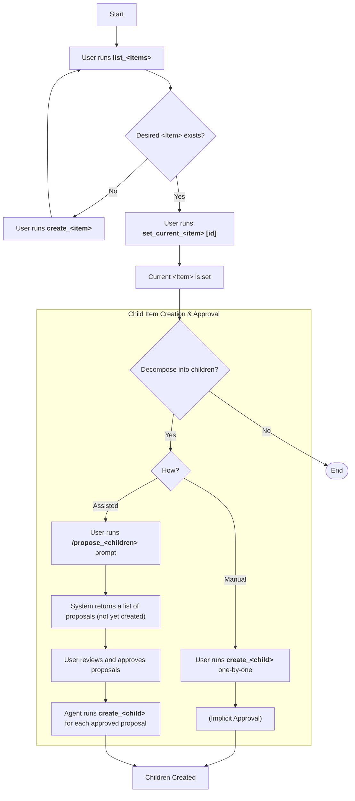
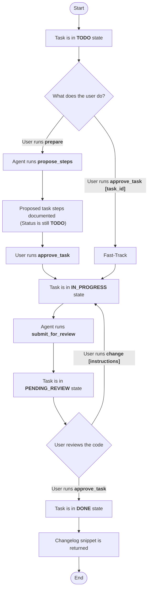

# Project Workflow Diagrams

This document outlines the command workflows for the Plan Manager.

---

### Unified Planning

The following diagram illustrates the single, consistent workflow used for planning at every level of the project hierarchy. It includes paths for both manual creation and prompt-assisted ("Assisted") creation of child work items.

**The Proposal-Approval Model**

A key concept in this workflow is that newly suggested items (especially from the "Assisted" path) are considered **proposals**, not final work items. The user must give an explicit approval before the agent proceeds to formally create them in the system. For manual creation, this approval is implicit in the act of creating the item.

**Connecting the Workflows**

The "Unified Planning" diagram shows how to select and define work items. When a **Task** is created and approved for the backlog (landing in the `TODO` state), its lifecycle begins, as illustrated in the diagram below.

---

### Task Execution Lifecycle

Once a task is set as the current work item, it follows a strict, two-gate review lifecycle. The state diagram below illustrates this process.

---

### A Note on Plan and Story Statuses

It is important to note that only `Task` items have a direct, manageable lifecycle. The status of a `Story` or a `Plan` is a **rolled-up property** that is automatically calculated based on the statuses of its children.

-   A **Story's status** is a summary of its `Task` statuses (e.g., if any task is `IN_PROGRESS`, the story is `IN_PROGRESS`).
-   A **Plan's status** is a summary of its `Story` statuses.

Because their statuses are not managed directly, there are no state diagrams for `Plan` or `Story` items. The `Task` lifecycle is the core driver of the entire system's state.
