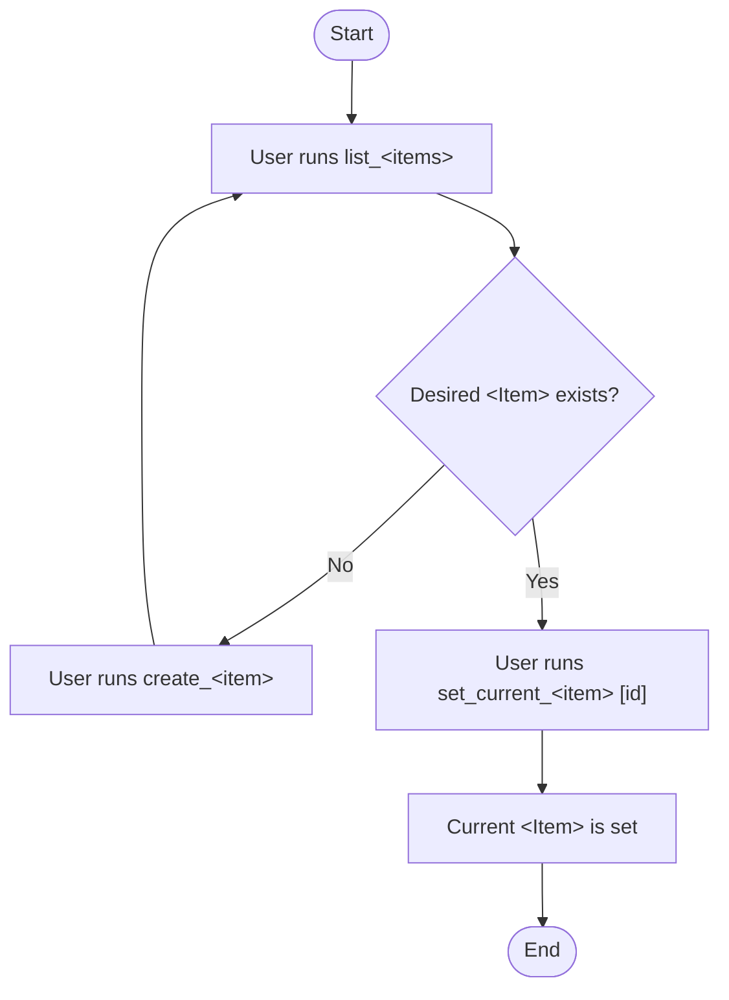
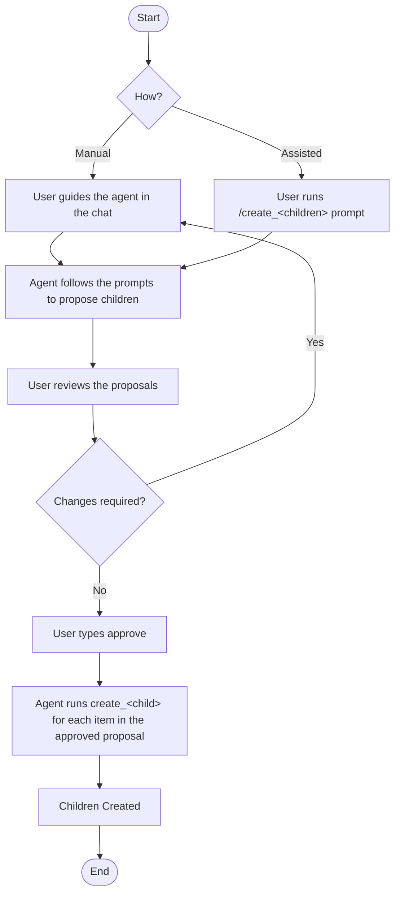
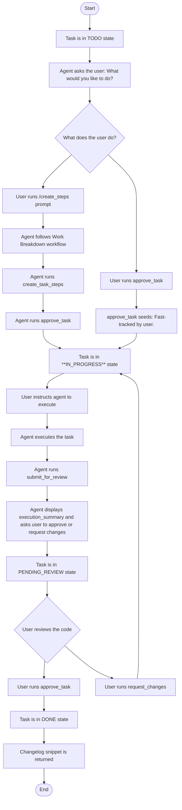

## Project Workflow Diagrams

This document outlines the command workflows for the Plan Manager.

### Overview

The [Unified Planning](#unified-planning) diagram shows how to define and select work items. 

The [Work Breakdown (Refinement)](#work-breakdown-refinement) diagram shows how to break a work item into well-defined children.

When a **Task** is picked for execution, its lifecycle begins, as illustrated in the [Task Execution](#task-execution) diagram.

---

### Unified Planning

The following diagram illustrates the single, consistent workflow used for creation and selection of the work items (plans, stories, tasks).

---

### Work Breakdown (Refinement)

The following diagram illustrates how a higher-level work item is decomposed into children. It includes paths for both manual creation and prompt-assisted ("Assisted") creation of child work items.

A key concept in this workflow is that newly suggested items are considered **proposals**, not final work items. The user must give an explicit approval before the agent proceeds to formally create them in the system. 

Assisted prompts used in this workflow:
- **create_plan**: draft a plan (epic) JSON, stage for review, then create the plan upon approval.
- **create_stories**: propose stories for a plan, stage for review, then create stories upon approval.
- **create_tasks**: propose tasks for a story, stage for review, then create tasks upon approval.
- **create_steps**: propose implementation steps for a task, stage for review, then attach steps upon approval.

---

### Task Execution

Once a task is set as the current work item, it follows a strict, two-gate review lifecycle:
1. Ready to start (gate)
2. PR (gate)

The diagrams below illustrate this process.

---

### Plan and Story Statuses

It is important to note that only `Task` items have a direct, manageable lifecycle. The status of a `Story` or a `Plan` is a **rolled-up property** that is automatically calculated based on the statuses of its children.

-   A **Story's status** is a summary of its `Task` statuses (e.g., if any task is `IN_PROGRESS`, the story is `IN_PROGRESS`).
-   A **Plan's status** is a summary of its `Story` statuses.

Because their statuses are not managed directly, there are no state diagrams for `Plan` or `Story` items. The `Task` lifecycle is the core driver of the entire system's state.
