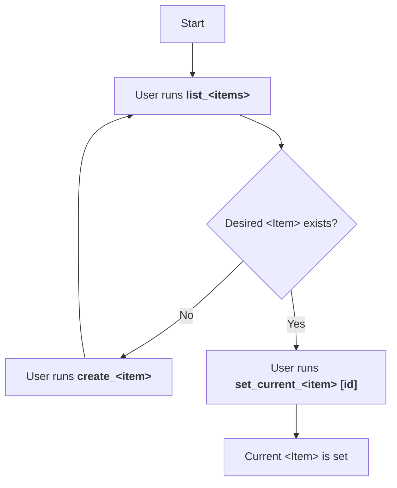
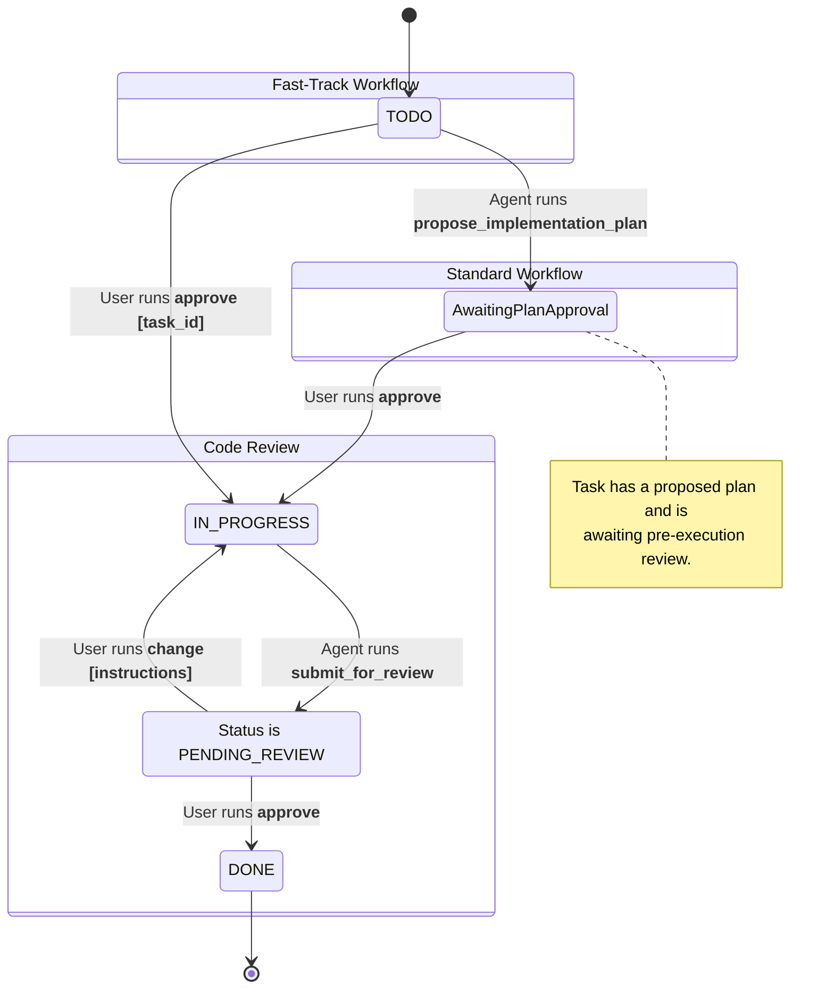

# Project Workflow Diagrams

This document outlines the command workflows for the Plan Manager.

---

### Unified Workflow for All Work Items (Plans, Stories, and Tasks)

The following diagram illustrates the single, consistent workflow used to manage context at every level of the project hierarchy (Plan, Story, and Task). This model is designed to be explicit and predictable, giving the user full control over their focus.

**Workflow Steps:**

1.  **List**: The user starts by running `list_<items>` (`list_plans`, `list_stories`, `list_tasks`) to see the available items.
2.  **Decide**: Based on the output, the user decides whether the item they want to work on exists.
3.  **Create (if needed)**: If the item does not exist, the user runs `create_<item>`. This command *only* creates the item; it does not set it as the current context. This allows for the bulk creation of multiple items without interruption. After creation, the flow returns to the listing step.
4.  **Set Current**: Once the desired item exists, the user runs `set_current_<item> [id]` to explicitly set it as their current focus.

---

### Task Execution Lifecycle

Once a task is set as the current work item, it follows a strict, two-gate review lifecycle. The diagram below illustrates this process.

---

### A Note on Plan and Story Statuses

It is important to note that only `Task` items have a direct, manageable lifecycle. The status of a `Story` or a `Plan` is a **rolled-up property** that is automatically calculated based on the statuses of its children.

-   A **Story's status** is a summary of its `Task` statuses (e.g., if any task is `IN_PROGRESS`, the story is `IN_PROGRESS`).
-   A **Plan's status** is a summary of its `Story` statuses.

Because their statuses are not managed directly, there are no state diagrams for `Plan` or `Story` items. The `Task` lifecycle is the core driver of the entire system's state.
