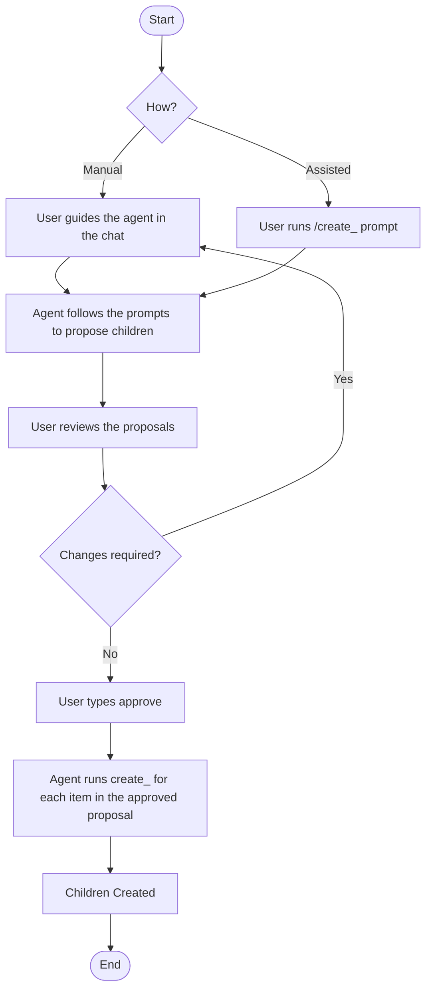
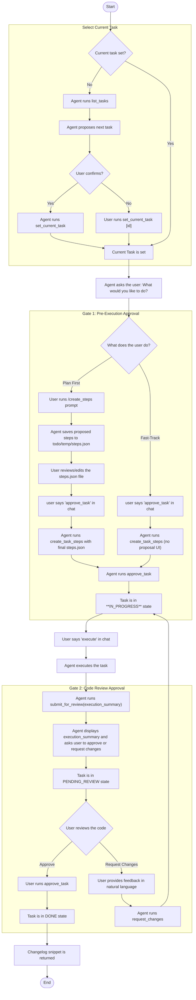

## Project Workflow Diagrams

This document outlines the command workflows for the Plan Manager.

### Overview

The user journey follows a logical progression from high-level planning to task execution:

1.  **[Unified Planning (Plans and Stories)](#unified-planning-plans-and-stories):** The workflow for defining and selecting high-level work items (plans and stories).
2.  **[Work Breakdown (Refinement)](#work-breakdown-refinement):** The process for decomposing a story into concrete tasks.
3.  **[Task Execution](#task-execution):** The guided lifecycle for selecting a task, getting it approved, and marking it as `DONE`.

---

### Unified Planning (Plans and Stories)

The following diagram illustrates the single, consistent workflow used for the creation and selection of high-level work items (plans, stories). This process is typically driven by the user in natural language.

---

### Work Breakdown (Refinement)

The following diagram illustrates how a higher-level work item (a Story) is decomposed into children (Tasks). It includes paths for both manual creation and prompt-assisted ("Assisted") creation of child work items.

A key concept in this workflow is that newly suggested items are considered **proposals**, not final work items. The user must give an explicit approval before the agent proceeds to formally create them in the system. 

Assisted prompts used in this workflow:
- **create_plan**: draft a plan (epic) JSON, stage for review, then create the plan upon approval.
- **create_stories**: propose stories for a plan, stage for review, then create stories upon approval.
- **create_tasks**: propose tasks for a story, stage for review, then create tasks upon approval.
- **create_steps**: propose implementation steps for a task, stage for review, then attach steps upon approval.

---

### Task Execution

The task execution lifecycle begins with selecting a task to work on. If a task is not already set as the current work item, the agent will proactively list the available tasks and suggest the next one. Once a task is selected, it follows a strict, two-gate review lifecycle:

1.  **Pre-Execution Approval (Gate 1):** The user approves the proposed steps (or fast-tracks the task) before work begins.
2.  **Code Review Approval (Gate 2):** After the agent submits its work, the user performs a final review to mark the task as done.

The diagrams below illustrate this process.

---

### Plan and Story Statuses

It is important to note that only `Task` items have a direct, manageable lifecycle. The status of a `Story` or a `Plan` is a **rolled-up property** that is a calculated based on the statuses of its children.

-   A **Story's status** is a summary of its `Task` statuses (e.g., if any task is `IN_PROGRESS`, the story is `IN_PROGRESS`).
-   A **Plan's status** is a summary of its `Story` statuses.

Because their statuses are not managed directly, there are no state diagrams for `Plan` or `Story` items. The `Task` lifecycle is the core driver of the entire system's state.
