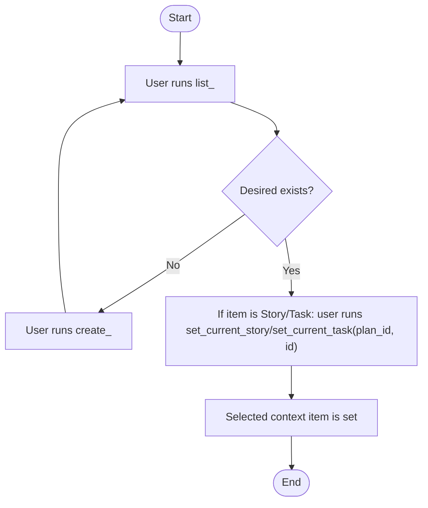
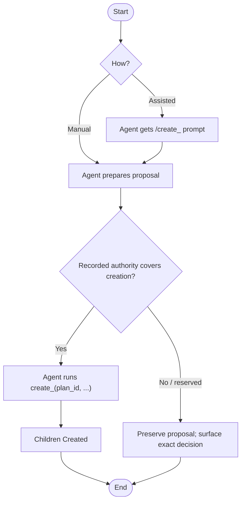
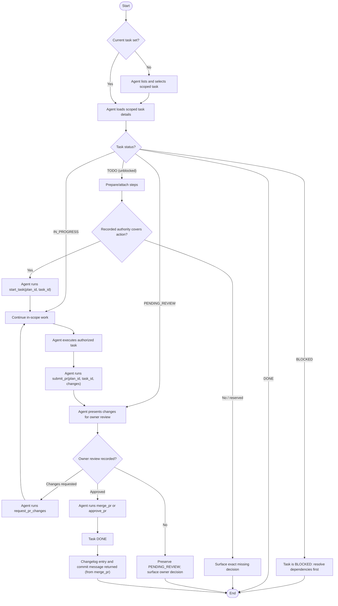

## Project Workflow Diagrams

This document outlines the command workflows for the Plan Manager.

All plan-scoped calls shown below require explicit `plan_id`.
Workflow mutations also require explicit `task_id`.

### Overview

The user journey follows a logical progression from high-level planning to task execution:

1.  **[Unified Planning (Plans and Stories)](#unified-planning-plans-and-stories):** The workflow for defining and selecting high-level work items (plans and stories).
2.  **[Work Breakdown (Refinement)](#work-breakdown-refinement):** The process for decomposing a story into concrete tasks.
3.  **[Task Execution](#task-execution):** The guided lifecycle for selecting a task, getting it approved, and marking it as `DONE`.

---

### Unified Planning (Plans and Stories)

The following diagram illustrates the single, consistent workflow used for the creation and selection of high-level work items (plans, stories). This process is typically driven by the user in natural language.

```mermaid
graph TD
    N1([Start]) --> N2["User runs list_<items>"];
    N2 --> N3{Desired <Item> exists?};
    N3 -- No --> N4["User runs create_<item>"];
    N4 --> N2;
    N3 -- Yes --> N5["If item is Story/Task: user runs set_current_story/set_current_task(plan_id, id)"];
    N5 --> N6["Selected context item is set"];
    N6 --> N7([End]);
```

---

### Work Breakdown (Refinement)

The following diagram illustrates how a higher-level work item (a Story) is decomposed into children (Tasks). It includes paths for both manual creation and prompt-assisted ("Assisted") creation of child work items.

A key concept is that suggested items are **proposals**, not authority.
Plan Manager does not grant or verify authority. When the caller's governing
context already records authority covering creation, the agent may create the
items without requesting the same approval again. If authority is missing,
exhausted, out of scope, or the decision is reserved, the agent preserves the
proposal and surfaces only that decision.

Assisted prompts use a fresh
`.plan-manager-tmp/<token>/<artifact>.json` path for every invocation. They
create through the matching tool when recorded authority covers the action;
otherwise they stop for the exact missing or reserved decision. Cleanup is
limited to the invocation-owned directory.

```mermaid
graph TD
    N1([Start]) --> N2{How?};
    N2 -- Manual --> N5["Agent prepares proposal"];
    N2 -- Assisted --> N4["Agent gets /create_<children> prompt"] --> N5;
    N5 --> N6{Recorded authority covers creation?};
    N6 -- Yes --> N7["Agent runs create_<child>(plan_id, ...)"];
    N6 -- No / reserved --> N8["Preserve proposal; surface exact decision"];
    N7 --> N9[Children Created] --> N10([End]);
    N8 --> N10;
```

---

### Task Execution

The task execution lifecycle begins by selecting a task. Plan Manager checks
status, steps, dependencies, and changes; authority remains in the caller's
governing context.

1. **Start and execution:** recorded covering authority permits preparation,
   `start_task`, and in-scope work without duplicate approval or an `execute`
   token. Missing or reserved authority stops only the affected action.
2. **Owner review:** after submission, `approve_pr` and `merge_pr` remain
   reserved until owner review approval is recorded. Changes, checks, and
   worker reports are not owner approval.

The diagrams below illustrate this process.

```mermaid
graph TD
    N1([Start]) --> N2{Current task set?};
    N2 -- No --> N3["Agent lists and selects scoped task"] --> N8;
    N2 -- Yes --> N8;
    N8["Agent loads scoped task details"] --> N8a{Task status?};
    N8a -- TODO (unblocked) --> N9["Prepare/attach steps"];
    N8a -- IN_PROGRESS --> N20["Continue in-scope work"];
    N8a -- BLOCKED --> NB[Task is BLOCKED: resolve dependencies first] --> N31;
    N8a -- PENDING_REVIEW --> N23;
    N8a -- DONE --> N31;
    N9 --> N10{Recorded authority covers action?};
    N10 -- No / reserved --> NX["Surface exact missing decision"] --> N31;
    N10 -- Yes --> N16["Agent runs start_task(plan_id, task_id)"];
    N16 --> N20;
    N20 --> N21["Agent executes authorized task"];
    N21 --> N22["Agent runs submit_pr(plan_id, task_id, changes)"];
    N22 --> N23["Agent presents changes for owner review"];
    N23 --> N25{Owner review recorded?};
    N25 -- No --> N28["Preserve PENDING_REVIEW; surface owner decision"] --> N31;
    N25 -- Changes requested --> N29["Agent runs request_pr_changes"] --> N20;
    N25 -- Approved --> N26a["Agent runs merge_pr or approve_pr"] --> N27[Task DONE];
    N27 --> N30["Changelog entry and commit message returned (from merge_pr)"];
    N30 --> N31([End]);
```

---

### Plan and Story Statuses

It is important to note that only `Task` items have a direct, manageable lifecycle. The status of a `Story` or a `Plan` is a **rolled-up property** that is calculated based on the statuses of its children.

#### Story Status Rules

A **Story's status** is derived from its tasks:
- **DONE**: All tasks are DONE
- **IN_PROGRESS**: Any task is IN_PROGRESS or PENDING_REVIEW, OR there's a mix of DONE and TODO/BLOCKED/DEFERRED tasks (indicating work has started but isn't complete)
- **TODO**: All tasks are TODO/BLOCKED/DEFERRED (no work has started)

This ensures that stories accurately reflect work progress. For example, if you've finished 2 tasks and have 3 more TODO tasks, the story will show as IN_PROGRESS rather than misleadingly appearing as TODO.

#### Plan Status Rules

A **Plan's status** is derived from its stories using the same logic:
- **DONE**: All stories are DONE
- **IN_PROGRESS**: Any story is IN_PROGRESS or PENDING_REVIEW, OR there's a mix of DONE and TODO stories
- **TODO**: All stories are TODO (no work has started)

Because their statuses are not managed directly, there are no state diagrams for `Plan` or `Story` items. The `Task` lifecycle is the core driver of the entire system's state.
